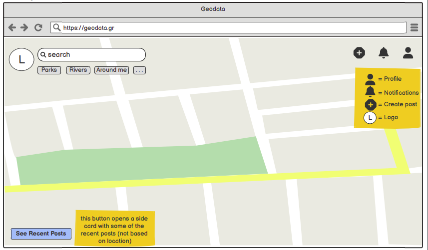
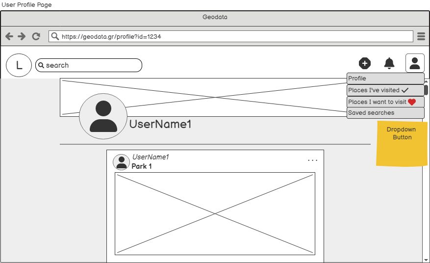
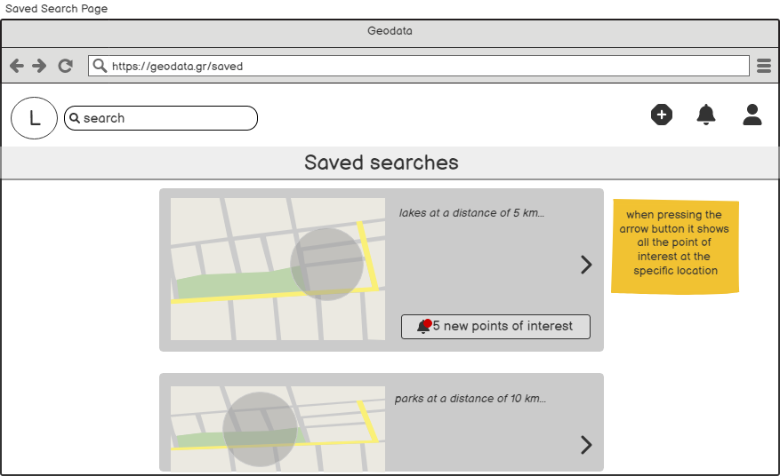

# GeoXplores Wireframes

## pdf version : **[GeoXplores.pdf](./wireframes/GeoXplores.pdf)**

We Designed the Wireframes bellow to help us visualize the structure and functionalities of the website. These wireframes are the core pages of our site.

### HomePage

Here we see the home page of a connected user, without the user having clicked the button to See Recent Posts. 

### Homepage with recents post

Here we see the home page of a connected user, with the user having clicked the button "See Recent Posts". On the left side of the screen a new window loads with some recents post from other users.

### Search

Here we see what it looks like when someone searches for a point of interest of their liking. It also shows that when a user hovers a search result it changes color, indicating that the location is being hovered.

### User Posts

Here we see what it looks like when someone clicks on a Point of Interest. On the left side of the screen are posts of other users who have visited the specific location. By pressing the button "Hide Posts" a user can hide the post screen whenever they want.

### Login Page

### Register Page

### Profile Page

The user's profile is displayed here. It has the user's profile and cover picture on the top of the page. Bellow that, it contains all posts the user has uploaded.

### Edit Profile

Here the editing of the user's profile is presented, in which the user can edit any personal registration data, as well as change the profile photo or the cover.

### Saved Search

Here is the page with saved searches of a user. The button "new point of interest", if pressed, redirects the user to the specific search, which now has more search results (updated point of interest in the specific search criteria)

### Upload Post

Here we see the creation of a new post. On the left side of the screen, the user selects a photo from the place they visited. On the right side, the user can write a description of this point of interest and add the location.

